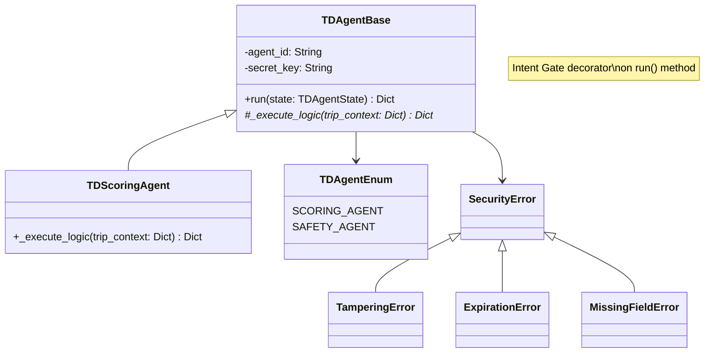

# Agent Framework with Intent Gate

A secure agent execution framework using signed Intent Capsules for permission management and execution control.

## Architecture



## Components

### Core Classes

- **TDAgentBase**: Abstract base for all agents
  - `run()`: Pure execution (validate → execute → wrap)
  - `_execute_logic()`: Override for custom logic
  - Protected by `@verify_intent_capsule` decorator

- **TDScoringAgent**: Scores trips based on harsh events
  - Formula: `100 - (harsh_events * 5)`, min 0

### Security

- **Intent Capsule**: Signed work order containing:
  - Trip ID, subject, purpose
  - Allowed actions & constraints
  - Issued/expiry timestamps
  - HMAC-SHA256 signature

- **Intent Gate**: Decorator that validates:
  - Signature (detect tampering)
  - Expiration (time window check)
  - Returns specific exceptions on failure

### Exceptions Hierarchy

```
AgentException
├── SecurityError
│   ├── TamperingError
│   ├── ExpirationError
│   └── ConstraintViolationError
└── ValidationError
    └── MissingFieldError
```

## Quick Start

### Installation

```bash
uv pip install pytest pytest-cov
```

### Run Tests

```bash
# All tests
pytest agentic-ai-20260325/test_agent_framework.py -v

# Specific test class
pytest agentic-ai-20260325/test_agent_framework.py::TestIntentGateValidation -v

# With coverage
pytest agentic-ai-20260325/test_agent_framework.py --cov
```

## Example Usage

```python
from TDScoringAgent import TDScoringAgent
from TDAgentBase import TDAgentEnum
from intent_gate import create_intent_capsule
import time

# 1. Create agent
agent = TDScoringAgent(
    agent_id=TDAgentEnum.SCORING_AGENT,
    secret_key="dev_secret"
)

# 2. Create signed capsule
capsule = create_intent_capsule(
    trip_id="TRIP-001",
    secret_key="dev_secret",
    expires_at=time.time() + 60
)

# 3. Execute with state
result = agent.run({
    "trip_id": "TRIP-001",
    "trip_context": {
        "trip_pings": [1, 2, 3],
        "harsh_events": 2
    },
    "intent_capsule": capsule
})

print(result["output"]["trip_score"])  # 90 (100 - 2*5)
```

## Test Coverage

- **18/18 tests passing** ✅
- Intent Capsule creation & signing
- Intent Gate validation (signature, expiration, tampering)
- Agent execution with valid/invalid capsules
- Scoring logic edge cases
- Output metadata validation

## Design Principles

- **Single Responsibility**: `run()` does only: validate → execute → wrap
- **Security by default**: Intent Gate decorator blocks invalid execution
- **Pure execution**: No logging/error handling in agent (Orchestrator's job)
- **Specific exceptions**: Different error types for different security failures
- **Testable**: No mocks needed; clean boundaries
