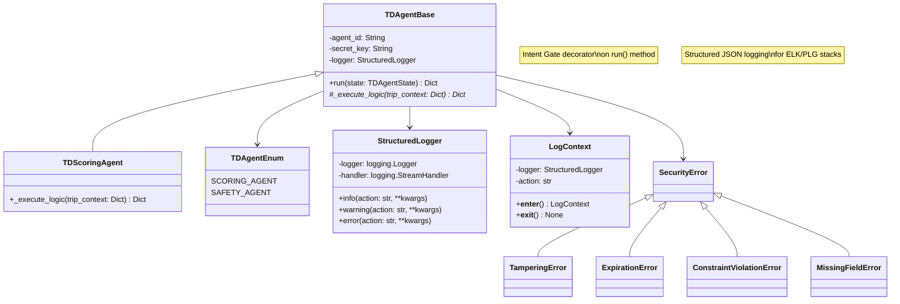
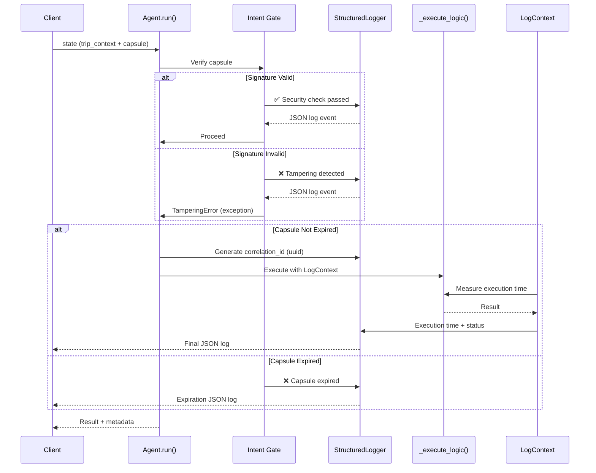
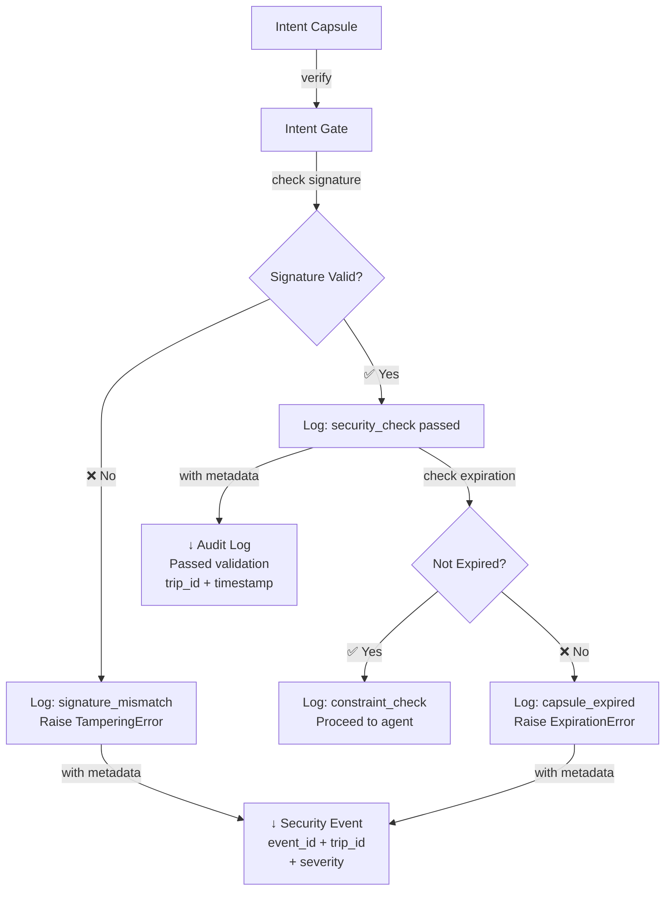

# Agent Framework with Intent Gate

A secure agent execution framework using signed Intent Capsules for permission management and execution control.

## Architecture

### Class Diagram



### Execution Flow with Security & Logging



### Structured Logging Format (ELK/PLG Compatible)

```json
{
  "timestamp": "2026-03-26T12:34:56.789Z",
  "level": "INFO",
  "action": "agent_execution_completed",
  "status": "success",
  "agent_id": "scoring_agent",
  "trip_id": "TRIP-001",
  "correlation_id": "550e8400-e29b-41d4-a716-446655440000",
  "duration_ms": 45.23,
  "output_keys": ["trip_score", "harsh_events_count"],
  "error": null,
  "timestamp_unix": 1711353296.789
}
```

### Security Event Logging



## Components

### Core Classes

- **TDAgentBase**: Abstract base for all agents
  - `run()`: Pure execution with structured logging (validate → execute → wrap)
  - `_execute_logic()`: Override for custom logic
  - Protected by `@verify_intent_capsule` decorator
  - Logger injected as instance variable for observability
  - Generates correlation IDs (uuid) for distributed tracing

- **TDScoringAgent**: Scores trips based on harsh events
  - Formula: `100 - (harsh_events * 5)`, min 0
  - Inherits logging and security validation from base class

- **StructuredLogger**: Production-ready JSON logging
  - Compatible with ELK (Elasticsearch/Logstash/Kibana) stacks
  - Compatible with PLG (Prometheus/Loki/Grafana) stacks
  - Methods: `info()`, `warning()`, `error()` with structured context
  - JSONFormatter for automatic JSON serialization

- **LogContext**: Context manager for operation tracing
  - Automatically measures execution time (duration_ms)
  - Tracks correlation IDs across distributed requests
  - Wraps operations for consistent logging

### Security

- **Intent Capsule**: Signed work order containing:
  - Trip ID, subject, purpose
  - Allowed actions & constraints
  - Issued/expiry timestamps
  - HMAC-SHA256 signature

- **Intent Gate**: Decorator that validates with structured event logging:
  - Signature verification (detect tampering)
  - Expiration check (time window validation)
  - Constraint validation (resource/action limits)
  - Logs all security events with: event_id, trip_id, severity, action, reason
  - Returns specific exceptions on failure
  - All events logged as JSON for audit trail

### Observability

- **Structured Logging**: JSON output includes:
  - Timestamp (ISO 8601 with milliseconds)
  - Log level (INFO, WARNING, ERROR)
  - Action identifier (what operation)
  - Status (success/failed/in-progress)
  - Agent/trip context (agent_id, trip_id)
  - Correlation ID (uuid for request tracing)
  - Duration metrics (execution time in ms)
  - Error details (if applicable)

- **Security Events**: Audit-grade logging with:
  - Unique security_event_id for tracking
  - Reason for security check result
  - Severity level (critical/medium/low)
  - Trip ID for affected resource correlation
  - Timestamp for forensics

### Exceptions Hierarchy

```
AgentException
├── SecurityError
│   ├── TamperingError
│   ├── ExpirationError
│   └── ConstraintViolationError
└── ValidationError
    └── MissingFieldError
```

## Data Models (Pydantic v2)

All data structures use Pydantic v2 for type safety and runtime validation:

- **TDAgentState**: Input to agent (trip_id, trip_context, intent_capsule)
- **CapsuleData**: Signed work order payload (trip_id, subject, purpose, constraints, timestamps)
- **CapsuleConstraints**: Execution limits (allowed_actions, resource_id, max_compute_time_seconds, max_harsh_events)
- **IntentCapsule**: Signed capsule (capsule + HMAC-SHA256 signature)
- **AgentOutput**: Computation result (trip_score, pings_count, harsh_events_count, action)
- **AgentResult**: Full response with metadata (agent, trip_id, timestamp, status, correlation_id, output)

All models include field validation and JSON schema export support.

## Quick Start

### Installation

```bash
uv pip install pytest pytest-cov
```

### Run Tests

```bash
# All tests (33 total)
pytest agentic-ai-20260325/test_agent_framework.py -v

# Specific test class
pytest agentic-ai-20260325/test_agent_framework.py::TestIntentGateValidation -v

# With coverage
pytest agentic-ai-20260325/test_agent_framework.py --cov
```

## Example Usage

```python
from TDScoringAgent import TDScoringAgent
from TDAgentBase import TDAgentEnum
from intent_gate import create_intent_capsule
from models import TDAgentState  # Pydantic models
import time

# 1. Create agent (logger automatically injected)
agent = TDScoringAgent(
    agent_id=TDAgentEnum.SCORING_AGENT,
    secret_key="dev_secret"
)

# 2. Create signed capsule
capsule = create_intent_capsule(
    trip_id="TRIP-001",
    secret_key="dev_secret",
    expires_at=time.time() + 60
)

# 3. Execute with Pydantic state model
# Logs are automatically emitted as JSON with:
# - correlation_id (uuid for request tracing)
# - duration_ms (execution time)
# - output details
trip_data = TDAgentState(
    trip_id="TRIP-001",
    trip_context={
        "trip_pings": [1, 2, 3],
        "harsh_events": 2
    },
    intent_capsule=capsule
)

result = agent.run(trip_data)

# Output uses dot notation (Pydantic models)
print(result.agent)              # "scoring_agent"
print(result.trip_id)            # "TRIP-001"
print(result.status)             # "success"
print(result.timestamp)          # ISO 8601 timestamp with Z suffix
print(result.output.trip_score)  # 90 (100 - 2*5)
print(result.correlation_id)     # UUID v4 for request tracing

# JSON logs output (viewable in ELK/PLG stacks):
# {
#   "timestamp": "2026-03-26T12:34:56.789Z",
#   "action": "intent_gate_validation",
#   "status": "passed",
#   "trip_id": "TRIP-001",
#   "security_event_id": "..."
# }
# {
#   "timestamp": "2026-03-26T12:34:56.834Z",
#   "action": "agent_execution_completed",
#   "status": "success",
#   "agent_id": "scoring_agent",
#   "trip_id": "TRIP-001",
#   "correlation_id": "...",
#   "duration_ms": 45.23
# }
```

## Test Coverage

- **33/33 tests passing** ✅ (includes 15 new comprehensive tests)

### Test Categories:

1. **TestIntentCapsuleCreation** (2 tests)
   - Capsule creation with valid parameters
   - Custom parameters (subject, purpose, allowed_actions)

2. **TestIntentGateValidation** (7 tests)
   - Valid capsule passes gate
   - Expired capsule rejected
   - Tampered capsule detected
   - Wrong secret key detected
   - Missing required fields raise ValidationError

3. **TestScoringAgent** (5 tests)
   - Scoring with various harsh_events counts
   - Score minimum capped at 0
   - Default values for missing fields

4. **TestAgentMetadata** (4 tests)
   - Result includes agent_id, trip_id, timestamp
   - Status always "success" on valid execution

5. **TestConstraintValidation** (2 tests)
   - max_harsh_events constraint storage
   - All constraint fields accessible

6. **TestSerialization** (3 tests)
   - AgentResult → dict with `model_dump()`
   - AgentResult → JSON with `model_dump_json()`
   - JSON roundtrip deserialization

7. **TestTypeValidation** (4 tests)
   - Rejects invalid trip_id type (int instead of str)
   - Rejects invalid trip_context type (str instead of dict)
   - Rejects negative harsh_events_count
   - Rejects invalid trip_score type

8. **TestCorrelationID** (2 tests)
   - Each result has a correlation_id
   - Different executions get unique IDs

9. **TestEdgeCases** (4 tests)
   - Handles very large harsh_events (10,000+)
   - Handles empty trip_pings list
   - Handles very long trip IDs (1000+ chars)
   - Handles special characters in trip IDs

## Design Principles

- **Single Responsibility**: `run()` does only: validate → execute → wrap
- **Security by default**: Intent Gate decorator blocks invalid execution
- **Pure execution**: No broad error handling in agent (let exceptions propagate)
- **Observability first**: Structured JSON logging for ELK/PLG stack integration
- **Distributed tracing**: Correlation IDs for request tracking across services
- **Audit-grade security events**: Unique event IDs with trip/agent context
- **Specific exceptions**: Different error types for different security failures
- **Testable**: No mocks needed; clean boundaries
- **Timing instrumentation**: Automatic duration tracking with LogContext
- **Production ready**: Compatible with major monitoring platforms (ELK, Prometheus/Loki)
