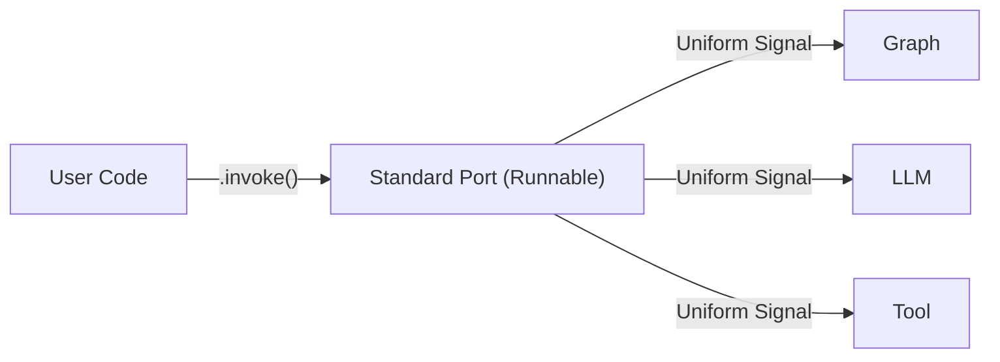
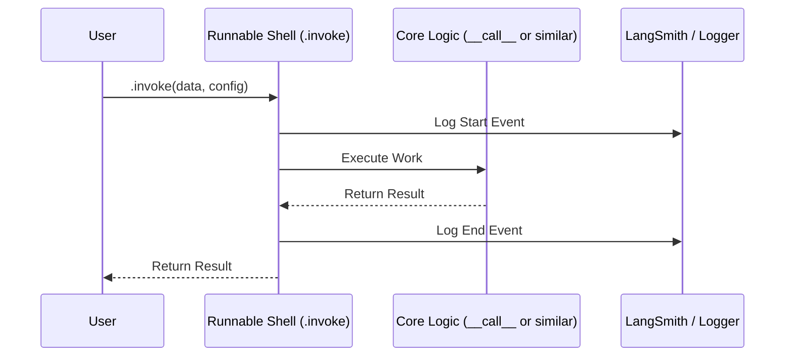

# Deep Learning Document — `invoke()` vs `__call__()`

## Common Mistakes
Mistake | Why people make it | What to do instead
---|---|---
Thinking `.invoke()` is just a slower `__call__` | They look identical in simple code. | Understand that `.invoke()` wraps your logic in a standardized "casing" (the Runnable Protocol).
Attempting to use `__call__` in complex chains | It works for simple objects, but breaks when using `.bind()` or `.config()`. | Stick to `.invoke()` as the universal "Start" button for any agentic component.

# 30,000 ft  → The one-sentence answer.
`.invoke()` is the standardized "Interface" or "Coupling" that allows any LLM, Tool, or Graph to be plugged into any other part of the system without custom adapters.

**Analogies:**
Think of `__call__` as a **custom soldered connection**—it works for that one specific part. Think of `.invoke()` as a **NEMA standard electrical plug** or an **ISO standard mechanical flange**. It doesn't matter what's inside the machine; if it has the standard flange, it fits the assembly line.



# 20,000 ft  → Where does this sit?
In standard Python, `__call__` makes an object "callable" like a function. But LangChain components are more than just functions; they are **Runnables**.

The `Runnable` interface is the core architectural standard of the LangChain ecosystem. By using `.invoke()`, you ensure your code works with:
1.  **Observability**: LangSmith automatically "sees" `.invoke()` calls.
2.  **Async**: Every `.invoke()` has a matching `.ainvoke()`.
3.  **Parallelism**: You get `.batch()` and `.abatch()` for free.
4.  **Streaming**: You get `.stream()` and `.astream()` for free.

# 10,000 ft  → The core idea.
The core insight: **Uniformity enables Composition.**

If every component has a different "start" method, you have to write custom "glue" code for every connection. If every component (Model, Prompt, Parser, Graph) uses `.invoke()`, then **Component A -> Component B** is theoretically always possible.

**WHAT is it?** A method defined by the `Runnable` protocol.
**WHY does it exist?** To provide a consistent signature (`input -> output`) regardless of what the component is.
**HOW does it work?** It wraps the internal logic in a `Runnable` sequence that handles configuration, tracing, and metadata routing.

# 5,000 ft  → How it actually works.
When you call `.invoke()`, LangChain does more than just run your code:

1.  **Config Injection**: It checks for a `config` dictionary (tags, metadata, thread IDs).
2.  **Callback Activation**: It signals any connected loggers (like the ones in your `base.py`).
3.  **input/output validation**: It ensures the data matches the expected type (like a `TypedDict` for a graph).
4.  **Trace propagation**: It carries the "Parent ID" so that if Node A calls Node B, the logs show Node B nested *inside* Node A.



# 2,000 ft  → The details that matter.
The biggest difference you'll see in production: **Config & Parallelism**.

*   **Config Routing**: `.invoke(input, config={"configurable": {"thread_id": "123"}})` handles state persistence automatically. A generic `__call__` wouldn't know how to route that metadata.
*   **The Async Problem**: If you use `__call__`, you often have to maintain two versions of your library (sync and async). With Runnables, `.invoke()` and `.ainvoke()` are strictly defined and supported across the board.

# 1,000 ft  → Hands-on code.
Look at how your `Agent` class handles it. By defining an `invoke` method, you are keeping your custom agent compatible with LangGraph's expectations.

```python
# In your base.py
def invoke(self, input_data: dict) -> dict:
    if self._agent is None:
        self._agent = self._create_agent()
    # We call .invoke() on the internal graph so it handles 
    # the state, recursion, and tracing correctly.
    return self._agent.invoke(input_data)
```

If you used `self._agent(input_data)`, you would lose the ability to pass a `config` dictionary or use streaming later.

# Ground    → A complete worked example.
Why `.invoke()` is "Mechanical Interoperability":

```python
# SWAPPABLE COMPONENTS
# Because both use .invoke(), the "Power Drill" (User Loop) 
# doesn't care if it's spinning a "Screw Bit" or a "Drill Bit".

from langchain_openai import ChatOpenAI
from langgraph.graph import StateGraph, END

# Component A: A raw LLM
model = ChatOpenAI(model="gpt-4o")

# Component B: A complex Graph
builder = StateGraph(dict)
builder.add_node("step1", lambda x: x)
builder.set_entry_point("step1")
builder.add_edge("step1", END)
graph = builder.compile()

# THE INTEROPERABILITY
def run_any_component(component, user_input):
    # This loop works for BOTH the raw LLM AND the complex Graph!
    return component.invoke(user_input)

# Test with Model
print(run_any_component(model, "Hi"))

# Test with Graph
print(run_any_component(graph, {"messages": ["Hi"]}))
```

## What This Connects To
*   **Concepts unlocked**: LCEL (LangChain Expression Language), Chain Composition (`component_a | component_b`).
*   **Next Steps**: Look into `.bind()`—it allows you to "hardwire" some parameters into `.invoke()` before you even call it.
*   **Existing Knowledge**: Built on **Standardization and Interfaces**. Like how all your machine parts might use **ANSI standards** for threading, `.invoke()` is the threading standard for LLM software.
