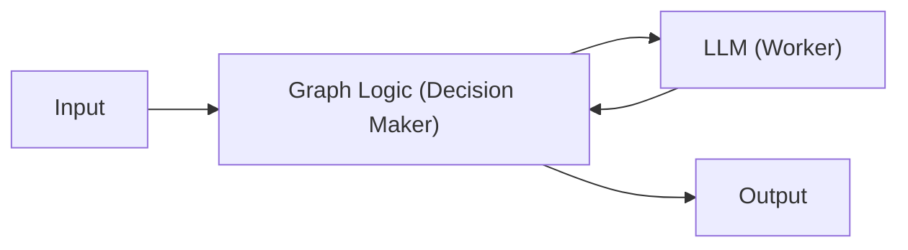
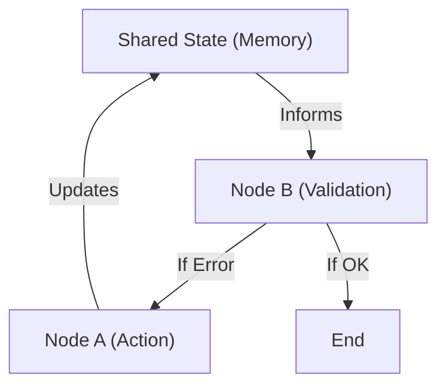
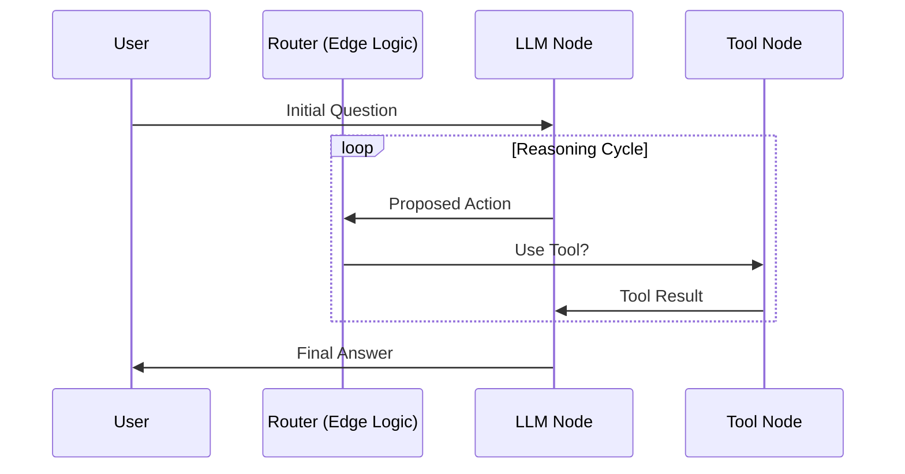

# Deep Learning Document — LangGraph with OpenAI

## Common Mistakes
Mistake | Why people make it | What to do instead
---|---|---
Treating the graph like a simple sequence (DAG) | LangChain (Chains) were linear. LangGraph is cyclic. | Think of it as a state machine where nodes can branch back or loop.
Not defining the 'State' clearly | Thinking the LLM just "remembers" everything automatically. | Explicitly define the `State` dict which is the "single source of truth".
Forgetting to 'Compile' | Code looks like it should run by itself once defined. | Use `.compile()` to transform your logic into an executable engine.

# 30,000 ft  → The one-sentence answer.
LangGraph is a coordination layer for LLM agents that treats logic like a programmable control loop or state machine, allowing for cycles, branches, and persistence.

**Analogies:**
If a standard LLM call is a single task (e.g. "mill this part"), LangGraph is the **program logic of the CNC machine** that decides which tool to pick next, measures the result, and decides if it needs another pass or if it's finished.



# 20,000 ft  → Where does this sit?
LangGraph sits above the raw LLM prompt. It solves the "Stuck in a Loop" or "Linear Thinking" problem of early agent frameworks.

Before LangGraph, chains were mostly "Step A -> Step B -> Step C". If Step B failed, the whole thing crashed or provided a bad answer. LangGraph introduces **Cycles**—the ability for the AI to "go back and check its work" or consult another tool multiple times until a condition is met.

# 10,000 ft  → The core idea.
The core insight: **State is everything.** In a physical assembly line, the "state" is the current condition of the workpiece on the belt. In LangGraph, the `State` is a shared data structure (usually a dictionary) that every node reads from and writes to.

**WHAT is it?** A state-driven orchestration framework.
**WHY does it exist?** To build complex, reliable AI agents that can handle multi-step reasoning with feedback loops.
**HOW does it work?** By defining a directed graph where nodes perform work and edges define the transition logic based on the current State.



# 5,000 ft  → How it actually works.
The mechanism follows a simple loop: **State -> Node -> Update -> Edge -> Repeat.**

1.  **State Definition**: Define the "blueprint" of the data the graph will hold (e.g., messages, search results).
2.  **Nodes**: These are simple Python functions. They take the current `State`, do something (like call OpenAI), and return an update to the `State`.
3.  **Edges**: These determine the "wiring."
    *   **Normal Edges**: Always go from A to B.
    *   **Conditional Edges**: Decision points (e.g., "If the LLM says 'finished', go to the end; else, go back to tools").
4.  **Compilation**: You "freeze" your graph into an executable application.



# 2,000 ft  → The details that matter.
The tricky parts are **Reducers** and **Checkpoints**.

*   **Reducers**: If two nodes update the same field in the `State`, how do they merge? By default, it replaces the value. But for a list of messages, you want to *append*. Reducers handle this logic.
*   **Checkpoints (Persistence)**: LangGraph can save the `State` after every step to a database (like Redis). If the process crashes or the user waits 5 minutes to respond, the graph "remembers" where it was.
*   **Human-in-the-loop**: You can pause the graph before a specific node (like `delete_database`) to get human approval.

# 1,000 ft  → Hands-on.
Here is the minimal code to build a "Thinking" LLM agent with LangGraph and OpenAI.

**Ensure your `.env` has `OPENAI_API_KEY`.**

```python
import operator
from typing import Annotated, TypedDict
from langchain_openai import ChatOpenAI
from langgraph.graph import StateGraph, END

# 1. Define the State (The Blueprint)
class GraphState(TypedDict):
    # We use operator.add to APPEND messages instead of replacing them
    messages: Annotated[list, operator.add]

# 2. Define the Nodes (The Workers)
model = ChatOpenAI(model="gpt-4o")

def call_model(state: GraphState):
    response = model.invoke(state["messages"])
    return {"messages": [response]}

# 3. Build the Graph
workflow = StateGraph(GraphState)

# Add our only node
workflow.add_node("agent", call_model)

# Define the flow
workflow.set_entry_point("agent")
workflow.add_edge("agent", END)

# 4. Compile it (The Engine)
app = workflow.compile()

# 5. Run it
result = app.invoke({"messages": [("user", "What is the mechanical advantage of a 3-pulley system?")]})
print(result["messages"][-1].content)
```

# Ground    → A complete worked example.
Let's build a **Self-Correcting Search Loop**. The AI will generate an answer, check if it's too short, and if so, try again with more detail.

```python
import operator
from typing import Annotated, TypedDict, Literal
from langchain_openai import ChatOpenAI
from langgraph.graph import StateGraph, END
from dotenv import load_dotenv
import os

load_dotenv()

# State schema
class State(TypedDict):
    input: str
    output: str
    revisions: int

# Configuration
llm = ChatOpenAI(model="gpt-4o-mini", temperature=0)

# NODE 1: Generator
def generate_draft(state: State):
    print(f"--- GENERATING DRAFT (Attempt {state.get('revisions', 0) + 1}) ---")
    prompt = f"Write a one-sentence summary of: {state['input']}. Be extremely detailed in that one sentence."
    response = llm.invoke(prompt)
    return {"output": response.content}

# NODE 2: Auditor (Decision point)
def check_length(state: State) -> Literal["pass", "fail"]:
    # Mock validation: Must have > 15 words
    word_count = len(state["output"].split())
    print(f"--- AUDITING: {word_count} words ---")
    if word_count > 15 or (state.get("revisions", 0) >= 2):
        return "pass"
    return "fail"

# NODE 3: Increment revision counter
def increment_revision(state: State):
    return {"revisions": state.get("revisions", 0) + 1}

# BUILD THE GRAPH
builder = StateGraph(State)

builder.add_node("generator", generate_draft)
builder.add_node("incrementer", increment_revision)

builder.set_entry_point("generator")

# Adding conditional edge from generator to next step
builder.add_conditional_edges(
    "generator",
    check_length,
    {
        "pass": END,
        "fail": "incrementer"
    }
)

builder.add_edge("incrementer", "generator")

# COMPILE
graph = builder.compile()

# RUN
initial_input = {"input": "How a heat pump uses refrigeration cycles to move energy.", "revisions": 0}
final_state = graph.invoke(initial_input)

print("\n--- FINAL RESULT ---")
print(final_state["output"])
```

## What This Connects To
*   **Concepts unlocked**: Multi-agent systems (teams of agents), long-term AI memory, human-in-the-loop workflows.
*   **Next Steps**: Learn about `ToolNode` to let the graph call real functions (like CAD APIs or search engines).
*   **Existing Knowledge**: Built on **Control Systems (Open-loop vs Closed-loop)**. LangGraph creates a closed-loop system for LLMs.
