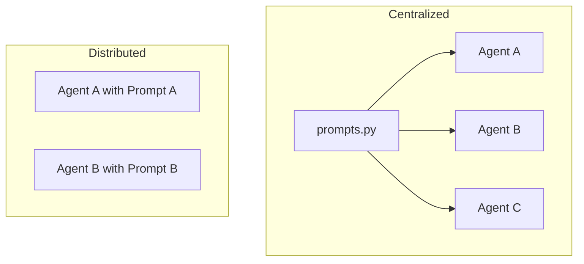

# Deep Learning Document — Prompt Architecture: Centralized vs. Distributed

## Common Mistakes
Mistake | Why people make it | What to do instead
---|---|---
Hard-coding long strings in class constructors | It's the "fastest" way to get it working in a notebook. | As soon as a prompt exceeds 5-10 lines, move it to a dedicated file or constant.
Mixing "Code Logic" (Python) with "Instruction Logic" (Prompts) | They are seen as one and the same. | Treat prompts like **configuration data** or **spec sheets**, not executable code.

# 30,000 ft  → The one-sentence answer.
Centralizing system prompts into a dedicated module is superior because it separates **HOW the machine runs (Python)** from **WHAT the machine is doing (Instructions)**.

**Analogies:**
*   **Distributed (In-file)**: Like etching the assembly instructions directly onto the robot's physical arm. If you want to change the instructions, you have to repaint the arm.
*   **Centralized (Prompt Registry)**: Like having a **Central Manual** or a **Master Blueprint Library**. When the task changes, you just swap the manual page. All robots still use the same physical arm logic.



# 20,000 ft  → Where does this sit?
In a modular AI application, you have three distinct layers:
1.  **The Engine (LangGraph/LangChain)**: The "transmission" that moves the state.
2.  **The Agent Logic (Python)**: The "chassis" that holds the tools and LLM.
3.  **The Instructions (Prompts)**: The "software/calibration" that determines behavior.

Keeping them in separate files prevents your Python logic from being "polluted" by triple-quoted strings that take up 200 lines of scroll space.

# 10,000 ft  → The core idea.
The core insight: **Prompts update 10x faster than code.**

During development, you will tweak a word in a prompt 50 times an hour. You will change the `invoke` logic maybe twice a week. If the prompt is buried in a 500-line class file, you are constantly searching for it.

**Pattern: The Prompt Registry**
Instead of a simple string, you treat prompts as a searchable registry or even a set of `.txt` or `.md` files.

# 5,000 ft  → The benefits of Centralization.
1.  **Version Control**: You can see exactly how the "Instructions" changed over time in Git without wading through code diffs.
2.  **Comparative Analysis**: You can open `prompts.py` and see exactly how the "Scoring Agent" differs from the "Safety Agent" side-by-side.
3.  **No-Code Friendly**: Eventually, someone *not* writing Python (like a Domain Expert or Product Owner) might want to edit the instructions. It's safe given a separate file.

# 2,000 ft  → The trade-offs.
*   **Fragmentation**: If you have 20 agents, a single `prompts.py` becomes a giant wall of text.
*   **The Solution**: Use a **Prompt Directory** instead of a single file (`agents/prompts/scoring_agent.py` or similar).

# 1,000 ft  → Code Example: `prompts.py`
Create a folder called `agents/prompts/` and an `__init__.py` that exports them.

```python
# agents/prompts/scoring_agent.py
SCORING_AGENT_SYSTEM_PROMPT = """
You are the Scoring Agent in TraceData...
[Your 50-line instruction here]
"""

# agents/prompts/orchestrator.py
ORCHESTRATOR_SYSTEM_PROMPT = """
You are the Orchestrator...
[Your 50-line instruction here]
"""
```

# Ground    → A complete refactored example.

### 📍 Step 1: Create the Registry
Create `d:\learning-projects\learning-agentic-ai\tracedata-skeleton-20260330\agents\prompts.py`:

```python
# agents/prompts.py

WEATHER_TRAFFIC_PROMPT = """
You are the Weather and Traffic Agent.
Your job:
1. Check weather...
2. Check traffic...
"""

SCORING_PROMPT = """
You are the Scoring Agent...
Score driver (0-100)...
"""
```

### 📍 Step 2: Use in your Agents
Edit `d:\learning-projects\learning-agentic-ai\tracedata-skeleton-20260330\agents\examples.py`:

```python
from agents.prompts import WEATHER_TRAFFIC_PROMPT

class ExampleWeatherTrafficAgent(Agent):
    def __init__(self, llm):
        # We just reference the constant. 
        # The code is clean and focuses on tools/name.
        super().__init__(
            llm=llm,
            agent_name="WeatherTrafficAgent",
            tools=[get_weather, get_traffic],
            system_prompt=WEATHER_TRAFFIC_PROMPT,
        )
```

## What This Connects To
*   **Concepts unlocked**: Separation of Concerns, Configuration Management.
*   **Next Steps**: Look into **Dyna-Prompts**—how to inject dynamic context into your centralized strings using Python's `.format()`.
*   **Existing Knowledge**: Built on **BOMs (Bills of Materials)**. You wouldn't scatter the quantity of each bolt inside the CAD file; you list them in a separate BOM table.
